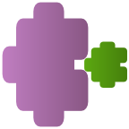

idock
=====

idock is a multithreaded virtual screening tool for flexible ligand docking for computational drug discovery. It is hosted by GitHub at https://github.com/HongjianLi/idock under Apache License 2.0.

Features
--------

* idock invents its own thread pool in order to reuse threads and maintain a high CPU utilization throughout the entire screening procedure. The thread pool parallelizes the creation of grid maps and the execution of Monte Carlo tasks.
* idock estimates the capacity of every vector structure and intensively utilizes Rvalue reference, a new feature in the C++11 standard, to avoid frequent memory reallocation.
* idock flattens Vina's tree-like recursive data structure of ligand into simple linear array structure to ensure a high data cache hit rate and easy coding.
* idock accelerates the assignment of atom types by making use of residue information for receptor and branch information for ligand, without explicitly detecting covalent bonds among atoms.

Tested platforms and compilers
------------------------------

* Arch Linux 3.0.6 x64 and GCC 4.6.1
* Windows 7 SP1 x64 and Windows SDK 7.1
* Windows 7 SP1 x64 and Visual Studio 2010

Compilation
-----------

idock depends on [Boost C++ Libraries](http://www.boost.org/). All the Boost versions newer than or euqal to 1.46.0 are tested. The Boost libraries required idock are `System`, `Thread`, `Filesystem`, and `Program Options`.

### Compilation on Linux

The Makefile uses GCC as the default compiler. One may modify the Makefile to use different compilation options or a different compiler.
To compile, simply type

    make

The generated objects will be placed in the `obj` folder, and the generated executable will be placed in the `bin` folder.

### Compilation on Windows

Visual Studio 2010 solution and project files are provided. One may open `idock.sln` in Visual Studio and do a full rebuild.

Usage
-----

First add idock to your PATH environment variable.

To display a full list of available options, simply run the program without arguments

    idock

The `examples` folder contains several testcases. One can supply the options from command line arguments

    idock --receptor receptors/3KFN.pdbqt --ligand_folder ligands/4DX --output_folder output --center_x 17.488 --center_y 5.151 --center_z 2.530 --size_x 20 --size_y 20 --size_z 18

Or one can instruct idock to load the options from a configuration file

    cd examples/3KFN/4DX
    idock --config config.txt

Change Log
----------

### 1.0 (2011-10-26)

* First release.

Contact Author
--------------

Jacky Lee (JackyLeeHongJian@Gmail.com)

Logo
----

Green grape is chosen as the logo for idock because it is the favorite fruit of the author.

